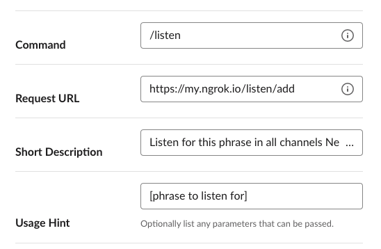
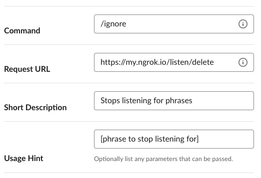

# Welcome to Earbot!

This guide will walk you through the configuration process and have you up and running with Earbot in just a few minutes!

## What is Earbot?

Earbot is a customizable listening bot for Slack. With Earbot you can:

- Add specific phrases for Earbot to listen for
- Configure which channel(s) you'd like Earbot to listen to
- Remove phrases you don't want Earbot to listen for any more

Earbot will send you a DM with a link to the message containing your listen phrase whenever it's mentioned across your Slack team.

## What you'll need before you get started:

1. A Slack team.
Before anything else you'll need a Slack team, free or paid. Either [Sign into an existing Slack workspace](https://get.slack.help/hc/en-us/articles/212681477-Sign-in-to-Slack) or [create a new Slack workspace](https://get.slack.help/hc/en-us/articles/206845317-Create-a-Slack-workspace).

2. A terminal with Python 3.6+ installed.
Check your installation by running the following command in your terminal:
```
$ python3 --version
-> Python 3.6.7
```

You'll need to install Python 3.6 if you receive the following error:
```
-> bash: python3: command not found
```


3. Docker and docker-compose.
If you're on macOS, you can use [Homebrew](https://brew.sh/) and run the following commands in Terminal or iTerm:
```
$ brew install docker docker-compose
```

4. A text editor of your choice. I prefer [Microsoft Visual Studio Code](https://code.visualstudio.com/).

### Give your app permissions

Create an app named Earbot on [Slack](https://api.slack.com/apps?new_app=1).

Navigate to **OAuth & Permissions** on the sidebar to add scopes to your app.

- Scroll down to the **Bot Token Scopes** section and click **Add an OAuth Scope**.

Add the following scopes:

- `channels:history`
- `chat:write`
- `commands`
- `groups:read`
- `users:read`

Save your changes.

### Install the app in your workspace

- Scroll up to the top of the **OAuth & Permissions** pages and click the green "Install App to Workspace" button.

You'll need to authorize the app for the Bot User permissions.

- Click the "Allow" button.

Copy and paste the Bot User OAuth Access Token somewhere locally after the app is installed. We'll need this soon.

Navigate to the "Basic Information" tab near the top of the left side navigation menu, click it and then scroll down and view and copy and paste the "Signing Secret" as well.

### Getting up and running with Docker

Clone this repo and navigate to the directory you've cloned to locally. Open and edit `docker-compose.yml`, replacing the following two environment variables with the token and secret you just saved:

```
      SLACK_BOT_TOKEN: YOUR_TOKEN_HERE
      SLACK_SIGNING_SECRET: YOUR_SECRET_HERE
```

Save the file, and run `docker-compose up` in your console, this will build the Docker image and launch the Earbot app!

### Configuring ngrok

In order to route Slack events and slash commands to our local Earbot app, we'll use [ngrok](https://ngrok.com/). Download, unzip, and move the ngrok executable wherever you'd like locally. From the directory that contains ngrok, run the following command:

```
$ ./ngrok http 3000
```

Executing this command will do the following:
- Route HTTP traffic destined for our ephemeral ngrok URL to port 3000 on our local machine

Once ngrok starts, you should see a status window in terminal that contains your randomized ngrok url. Copy and paste this url but **leave ngrok running!** the url will change when you restart ngrok, and you'll have to reauthenticate your local Earbot app within the Slack app dashboard.

### Configuring the events listener

Now that our app is up and running, and listening on the right port, we can activate the Slack Events API to start sending events to our local app. Head back to your Earbot app configuration within the Slack API dashboard. On the left hand navigation menu, click on "Event Subscriptions".

Toggle "Enable Events" to on. This will reveal the "Request URL" field. Paste your ngrok URL in this field, and append `/slack/events` to the end of the URL. So, if your ngrok URL is `https://my.ngrok.io` then you'd put `https://my.ngrok.io/slack/events` in this field. The URL should return "Verified" if your Earbot app is running locally along with ngrok.

Add the following Bot User Event:
- `message.channels`

Click on save and you'll see an alert saying permissions have changed and your Slack app needs to be reinstalled. But, before you do that, head over to "Slash Commands" on the left had nav menu.

### Adding slash commands

Add the following two slash command configurations, replacing `my.ngrok.io` with your unique ngrok URL. These commands will allow us to customize which phrases we want listened for.

`/listen` command:


`/ignore` command:


Save your changes, and that's it! We're ready to start using Earbot!

### Usage

Earbot will listen for any phrases you send it, and monitor for those phrases in the channel you sent the `/listen` command in. So, if you want to listen for the word `pizza` in the channel `team-lunch`, then you'd add Earbot to the `team-lunch` channel, and send the following command from within said channel:

```
/listen pizza
```

Earbot will confirm the phrase and channel to listen for. If you don't want to listen for pizza any more in `team-lunch`, send the following command:

```
/ignore pizza
```

Earbot will once again confirm the configuration change.

Whenever a matching message is sent within your Slack workspace in a channel you've configured to listen in, Earbot will send you an alert!

## Credits

Inspired by https://github.com/slackapi/python-slackclient


